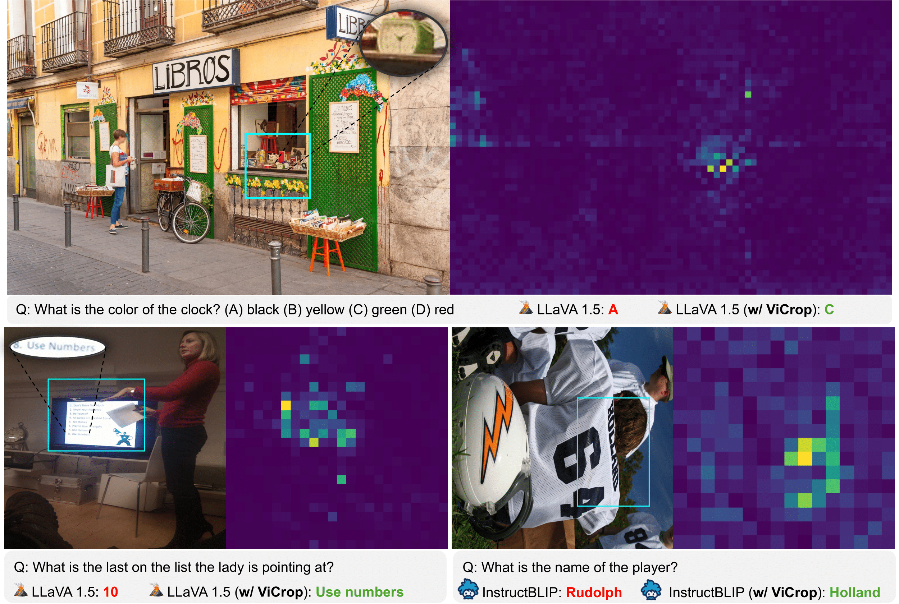

<p align="center">
  <h2 align="center" style="margin-top: -30px;">MLLMs Know Where to Look: <br>Training-free Perception of Small Visual Details with Multimodal LLMs</h2>
</p>

<div style="font-family: charter;" align="center">
    <a href="https://saccharomycetes.github.io/" target="_blank">Jiarui Zhang</a>,
    <a href="https://mahyarkoy.github.io/" target="_blank">Mahyar Khayatkhoei</a>,
    <a href="https://www.prateekchhikara.com/" target="_blank">Prateek Chhikara</a>,
    <a href="https://www.ilievski.info/" target="_blank">Filip Ilievski</a>
</div>

<br>

<p align="center">
  
</p>


Code for the ICLR 2025 Paper "[MLLMs Know Where to Look: Training-free Perception of Small Visual Details with Multimodal LLMs](https://openreview.net/forum?id=DgaY5mDdmT)".


## Environment Setup
```
conda create -n mllms_know python=3.10
conda activate mllms_know
pip install -r requirements.txt
```
Install a modified transformers library
```
cd transformers
pip install -e .
cd ..
```

Then we can follow the instructions in this [demo](quick_start.ipynb) jupyter notebook to run the code, and visualize the obtained attention/gradient maps and the model's outcome.

To run our method on benchmark datasets, please download the datasets and corresponding images to your local directory, and fill in you actual local directory path in the `info.py` file. Data processing is performed in the function `process_data` in the `utils.py` file.

After downloading the datasets, you can run the following command to process the data. For example, if you want to run rel_att of LLaVA-1.5 on TextVQA, you can run the following command (assuming running on 8 GPUs).
```
bash run_all.sh textvqa llava rel_att
```


## Citation

If you find our paper and code useful for your research and applications, please cite using this BibTeX:
```bibtex 
@inproceedings{
zhang2025mllms,
title={{MLLM}s Know Where to Look: Training-free Perception of Small Visual Details with Multimodal {LLM}s},
author={Jiarui Zhang and Mahyar Khayatkhoei and Prateek Chhikara and Filip Ilievski},
booktitle={The Thirteenth International Conference on Learning Representations},
year={2025},
url={https://openreview.net/forum?id=DgaY5mDdmT}
}
```